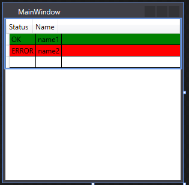

```
<Window x:Class="stackDatagridColor.MainWindow"
        xmlns="http://schemas.microsoft.com/winfx/2006/xaml/presentation"
        xmlns:x="http://schemas.microsoft.com/winfx/2006/xaml"
        xmlns:viewModels="clr-namespace:stackDatagridColor"
        Title="MainWindow" Height="350" Width="525">
    <Window.Resources>
        <viewModels:viewmodel x:Key="viewmodel"/>
        <viewModels:BrushConverter x:Key="BrushConverter"/>
    </Window.Resources>
    <Grid>
        <StackPanel>
            <DataGrid ItemsSource="{Binding Collection, Mode=TwoWay, Source={StaticResource viewmodel}, UpdateSourceTrigger=PropertyChanged}">
                <DataGrid.RowStyle>
                    <Style TargetType="DataGridRow">
                        <Style.Triggers>
                            <DataTrigger Binding="{Binding Status}" Value="ERROR">
                                <Setter Property="Background" Value="Red"></Setter>
                            </DataTrigger>
                            <DataTrigger Binding="{Binding Status}" Value="OK">
                                <Setter Property="Background" Value="Green"></Setter>
                            </DataTrigger>
                        </Style.Triggers>
                    </Style>
                </DataGrid.RowStyle>
            </DataGrid>
        </StackPanel>
    </Grid>
</Window>
```

ViewModel : 

```
public class viewmodel : INotifyPropertyChanged
{

    private ObservableCollection<myItem> collection;
    public ObservableCollection<myItem> Collection
    {
        get { return collection; }
        set { collection = value; OnPropertyChanged("Collection"); }
    }


    public viewmodel()
    {
        Collection = new ObservableCollection<myItem>();
        myItem item1 = new myItem { Name = "name1", Status = "OK" };
        myItem item2 = new myItem { Name = "name2", Status = "ERROR" };
        DispatchService.Invoke(() =>
            {
                Collection.Add(item1);
                Collection.Add(item2);
            });
    }


    #region INotifyPropertyChanged Members

    public event PropertyChangedEventHandler PropertyChanged = delegate { };

    protected void OnPropertyChanged(string propertyName)
    {
        PropertyChangedEventHandler handler = PropertyChanged;
        if (handler != null)
        {
            handler(this, new PropertyChangedEventArgs(propertyName));
        }
    }

    #endregion
}
```

a simple class:

```
public class myItem
    {
        public string Status { get; set; }
        public string Name { get; set; }
    }
Dispatcher class (to change the collection from the UI Thread taken from here):

public static class DispatchService
    {
        public static void Invoke(Action action)
        {
            Dispatcher dispatchObject = Application.Current.Dispatcher;
            if (dispatchObject == null || dispatchObject.CheckAccess())
            {
                action();
            }
            else
            {
                dispatchObject.Invoke(action);
            }
        }
    }

```

And finally the converter:

```
public class BrushConverter : IValueConverter
{
    public object Convert(object value, Type targetType, object parameter, System.Globalization.CultureInfo culture)
    {
        string input = value as string;
        switch (input)
        {
            case "ERROR":
                return Brushes.Red;
            case "OK":
                return Brushes.Green;
            default:
                return DependencyProperty.UnsetValue;
        }
    }

    public object ConvertBack(object value, Type targetType, object parameter, System.Globalization.CultureInfo culture)
    {
        throw new NotSupportedException();
    }
}
```


Goto : https://stackoverflow.com/questions/28600727/how-to-change-background-of-datagrid-row-depending-on-value-in-one-column